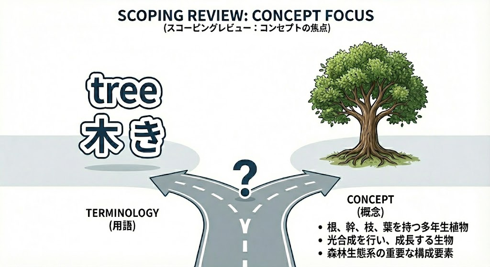

> このテンプレートの使い方
>
> この文書はスコーピングレビュー (scoping review) のプロトコルテンプレートです。`[English label / 日本語ラベル: 記入する内容]` で示した箇所を、自分たちのレビュー内容に置き換えてください。
>
> まず `2. Research question` で PCC (Population / Concept / Context) を決め、次に `3.3 Eligibility criteria` の各サブセクション、`Appendices` の検索式、`3.5 Charting the data` の抽出項目を埋めると進めやすいです。固定文は原則そのまま使えますが、レビュー内容に合わない場合はメンターに確認して修正してください。
>
> Note は作成中の補助説明です。提出版や登録版では、必要に応じて削除してください。
> メンターの所属は `https://docs.google.com/document/d/1v3R5iXCcbCAtpSlzbRUL09VJAFqseUaaiO61AQdxugA/edit?usp=sharing` を参照してください。
>
> ライセンス: 本テンプレートは [CC BY 4.0](https://creativecommons.org/licenses/by/4.0/) で公開されています。出典として Zenodo DOI を明記すれば、利用・改変・再配布が可能です。

\newpage

# Title

Title: [review title / レビュータイトル: 対象者 (Population)、コンセプト (Concept)、コンテクスト (Context) が分かる短い英語表現]: a scoping review protocol

> Note: 過去版の更新としてプロトコルを公開する場合は、本タイトル末尾に "(update)" を付け、YAML front-matter の `is-update` を `true` に変更してください。

## Authors:

> メンターの名前もお忘れなく

Corresponding author: [corresponding author / 連絡著者（メンティー）: full name]

Address: [address / 連絡著者の所属先住所: department, institution, postal address]

E-mail: [e-mail / 連絡著者の連絡先メールアドレス]

Author contributions:

[guarantor initials / 連絡責任者のイニシャル] is the guarantor. [drafting author initials / 原稿ドラフト担当者のイニシャル] drafted the manuscript. [search strategy author initials / 検索式担当者のイニシャル] developed the search strategy. [content expert initials / 臨床・方法論の専門家のイニシャル] provided expertise on [expertise area / 専門領域: target population, concept, methodology, etc.]. All authors read, provided feedback and approved the final manuscript.

\newpage

# 1. Introduction

> Note: 背景の書き方
>
> すべての記述にリファレンスを付けてください。3 パラグラフ構成を推奨します。
>
> 第一パラグラフ — テーマ (Population) について 4–5 文。例:
>
> 1. テーマの臨床的・社会的重要性
> 2. 対象集団の規模と影響
> 3. これまでに知られている標準的アプローチ
> 4. 現状の課題・知識のギャップ
>
> 第二パラグラフ — Concept について 4–5 文。例:
>
> 1. 関心のあるコンセプト (介入、アセスメント、アウトカム、定義など) の説明
> 2. このコンセプトに関する報告のばらつきや用語の不統一の現状
> 3. レビューで明らかにしたい範囲・側面
>
> 第三パラグラフ — なぜスコーピングレビューを行うのか 3–4 文。例:
>
> 1. このテーマに関する既存の systematic review / scoping review の検索結果（無ければ「未発見」、有れば本レビューがどう違うかを 1 文）
> 2. 文献の幅 (scope) や利用可能なエビデンスの広がりを把握することが必要な理由
> 3. そのため本研究ではこのテーマにおけるスコーピングレビューを行う
>
> 背景を対話で指導してくれる GPTs: [https://chatgpt.com/g/g-YF7pcAKdG-background-editor](https://chatgpt.com/g/g-YF7pcAKdG-background-editor)
> すべての記述に必要に応じてリファレンスを付ける

# 2. Research question

Using the PCC (Population, Concept, Context) framework, we state the questions this scoping review will address as follows.

- P (Population): [participants / 対象者: disease, condition, age range, care setting, etc.]
- C (Concept): [concept / コンセプト: the core concept the review will map — intervention, assessment, phenomenon, experience, etc. Specify whether the concept is defined by a fixed **terminology** or by a broader **concept**]
- C (Context): [context / コンテクスト: setting, region, time period, cultural background, etc. that bound the question]

Review questions:

1. [research question 1 / リサーチクエスチョン 1: a specific question phrased using PCC]
2. [research question 2 / リサーチクエスチョン 2: list more questions if needed]
3. [research question 3 / リサーチクエスチョン 3: add as needed]

## Keywords

> Note: アルファベット順に 5 つまで、セミコロンとスペースで区切って記載する（タイトルやアブストラクトに現れる語と異なることが理想的）。

[keywords / キーワード: e.g. concept; intervention; population; scoping review; setting]

# 3. Method

## 3.1 Protocol

This protocol was prepared with reference to the best-practice guidance for scoping review protocols by Peters et al. [@peters2022bestpractice], the JBI methodological guidance for the conduct of scoping reviews [@peters2020jbi;@peters2020jbimanual], and the PRISMA Extension for Scoping Reviews (PRISMA-ScR) [@tricco2018prismascr]. This protocol uses the scoping review protocol template maintained by SRWS-PSG [@Kataoka2026-cj]. The protocol will be made publicly available on OSF.io ([https://osf.io/](https://osf.io/)).

We adopt the JBI five-stage framework (Stage 1: identifying the research question / Stage 2: identifying relevant studies / Stage 3: study selection / Stage 4: charting the data / Stage 5: collating, summarizing, and reporting the results) [@peters2020jbimanual].

## 3.2 Stage 1: Identifying the research question

See §2 for the research questions.

## 3.3 Stage 2: Identifying relevant studies (eligibility criteria)

Using the PCC framework [@peters2020jbi], we define the inclusion criteria as follows.

### 3.3.1 Participants

[participants overview / 対象者の概要: describe the disease, condition, age range, and care setting in prose]

Inclusion criteria: [participant inclusion criteria / 対象者の組入基準: target condition, diagnostic criteria, age, sex, severity, setting]

Exclusion criteria: [participant exclusion criteria / 対象者の除外基準: comorbidities, prior treatments, specific subgroups to exclude]

### 3.3.2 Concept

[concept overview / コンセプトの概要: レビューの中核概念を文章で説明]

{#fig:concept-focus width=100%}

> Note: 上図のように、Concept を狭く特定の 用語 (terminology) で定義するのか、関連する語や派生語を含む広い 概念 (concept) として定義するのかを明示してください（これが検索式・組み入れ判断の幅を決めます）。

Inclusion criteria: [concept inclusion criteria / コンセプトの組入基準: the range of terms or related concepts that will be included]

Exclusion criteria: [concept exclusion criteria / コンセプトの除外基準: terms or related concepts that will be excluded]

### 3.3.3 Context

[context overview / コンテクストの概要: setting, region, time period, cultural background, etc.]

Inclusion criteria: [context inclusion criteria / コンテクストの組入基準: e.g. acute-care hospitals, home setting, high-income countries, specific health-care systems]

Exclusion criteria: [context exclusion criteria / コンテクストの除外基準: e.g. animal experiments, exclusion of specific cultural settings]

### 3.3.4 Types of sources

[study designs / 組み入れる研究デザイン: e.g. quantitative studies (RCT, non-RCT, before-after, cohort, case-control, cross-sectional, case series, case reports), qualitative studies, systematic reviews, grey literature — list whichever fits the research question]

> Note: 学会抄録は情報量が少ないため除外することも多いです。組み入れる/除外する場合は理由をメンターに相談のうえ明示してください。

### 3.3.5 Search method

> Note: 初回プロトコル作成時は、まず MEDLINE のみを完成させ、CENTRAL・Embase・各レジストリの検索式は後回しにして構いません（プロトコルのほかのパートが完成後、メンターの確認を経てから他データベース・レジストリの検索式を整えます）。

#### 3.3.5.1 Electronic search

We will search the following databases.

1. MEDLINE (PubMed)
2. the Cochrane Central Register of Controlled Trials (CENTRAL)
3. Embase (Dialog)

See Appendices 1, 2, and 3 for the search strategies.

#### 3.3.5.2 Other resources

We will search the following registries for ongoing or unpublished studies.

1. the World Health Organization International Clinical Trials Registry Platform (ICTRP)
2. ClinicalTrials.gov

See Appendices 4 and 5 for the search strategies.

We will also check the reference lists of included studies, as well as the reference lists of articles that cite the included studies. We will contact original authors to request any unpublished or additional data. If grey literature (government reports, theses, white papers from organizations, etc.) will be included, list the information sources here: [grey literature sources / 灰色文献の情報源: e.g. WHO database, OpenGrey, thesis databases].

### 3.3.6 Report characteristics

We will limit included documents by the following report characteristics.

- Language: [language / 言語: e.g. English and Japanese, or no language restriction]
- Years considered: [years considered / 検索対象年: e.g. 2000 onward, or no year restriction]
- Publication status: [publication status / 出版状態: state how peer-reviewed articles, preprints, and conference abstracts will be handled]

## 3.4 Stage 3: Study selection

Two independent reviewers ([screening reviewers / スクリーニング担当者のイニシャル: initials of two reviewers]) will screen titles and abstracts using the Tiab Review plugin [@Kataoka2026-tb]. All records flagged by either reviewer will proceed to full-text review, after which the two reviewers will independently assess eligibility based on the full text. We will contact original authors when eligibility cannot be determined (e.g. when only an abstract is available). Disagreements between the two reviewers will be resolved by discussion, with a third reviewer ([third reviewer / 第三レビュアーのイニシャル: initials]) consulted as needed. The search results and inclusion process will be reported in the final scoping review using a PRISMA-ScR flow diagram [@tricco2018prismascr].

> Note: 3 人以上で screening を行う場合は "two of three independent reviewers..." と記載してください。

## 3.5 Stage 4: Charting the data

Two reviewers ([data extraction reviewers / データ抽出担当者のイニシャル: initials of two reviewers]) will independently extract data from the included studies. The extracted data will include specific details about participants, concept, context, study methods, and key findings relevant to the review questions. The data-charting form (see Appendix 6) will be pilot-tested in advance on 10 randomly selected studies.

> Note: スコーピングレビューでは個別研究のアウトカム値を抽出して統合することは通常行いません [@peters2022bestpractice]。代わりに、レビュー設問に答えるために必要な「データ項目 (data items)」を Appendix 6 のチャーティングフォームに明示し、その優先順位 (必須項目 / 任意項目) を決めておきます。

Disagreements will be resolved by discussion, with a third reviewer ([third reviewer / 第三レビュアーのイニシャル: initials]) consulted as needed. We will contact original authors to request additional information when needed.

For efficiency, AI may be used to assist data extraction as appropriate [@Gartlehner2025-cm;@Kataoka2025-kq]. The actual use of AI will be reported in accordance with the Position Statement on Artificial Intelligence (AI) Use in Evidence Synthesis Across Cochrane, the Campbell Collaboration, JBI, and the Collaboration for Environmental Evidence 2025 [@Flemyng2025-ru].

> Note (Risk of bias, optional): スコーピングレビューでは通常、個別研究のバイアスリスク評価 (critical appraisal) は実施しません [@peters2022bestpractice]。レビュー設問上必要と判断する場合は、評価する単位 (個別研究レベル / アウトカムレベル / 両方)、使用するツール、および評価結果を結果の統合でどう扱うかを以下に記載してください: [risk of bias plan / バイアスリスク評価計画: ツール名、評価レベル、結果の扱い方]。

## 3.6 Stage 5: Collating, summarizing, and reporting the results

We will synthesize the extracted data qualitatively, presenting results in a form that directly addresses the review questions. The presentation format (tables, figures, evidence and gap map, etc.) will be chosen to match the nature of the data [@south2023visualisation;@fredlund2024egm]. We plan to present the following.

1. A PRISMA-ScR flow diagram (inclusion process)
2. A characteristics table of included studies (columns for Author / Year / Country / Population / Concept / Context / Methodology / Key findings; see Appendix 6)
3. [planned visualisations / 提示予定の図表: e.g. evidence gap map, bubble plot, matrix map, timeline, narrative summary — choose the visualisation that fits the topic, using Table 3 in Fredlund et al. [@fredlund2024egm] and the worked example by South et al. [@south2023visualisation] as references]

> Note (Meta-bias, optional): スコーピングレビューでは通常、出版バイアス等のメタバイアス評価は実施しません [@peters2022bestpractice]。実施する場合はその方法を以下に記載してください: [meta-bias plan / メタバイアス評価計画]。

> Note (Confidence in cumulative evidence, optional): スコーピングレビュー用に確立された GRADE はまだ存在しません [@peters2022bestpractice]。

# 4. Conflict of Interest

There is no conflict of interest in this project.

# 5. Funding

This work was self-funded.

> Note: 金銭的支援（英文校正費・データベース利用料・解析支援費など）に加え、人手の支援（例: 司書による検索式作成支援、AI ツールの提供、所属機関のサポート等）があれば記載してください。資金提供者やスポンサーがいる場合は、その名称と、本研究のデザイン・データ収集・解析・結果解釈・出版判断のいずれに関与/不関与かも併記してください [@peters2022bestpractice]。いずれもなければ「自己資金。」のままで構いません。

# Use of artificial intelligence in manuscript preparation

We used [AI tool and version / 使用した生成 AI の名称とバージョン: e.g., Claude Code (Anthropic), v2.1.168, model Claude Opus 4.8] to proofread and copy-edit the text of this protocol. AI was not used to generate or select references, to produce or interpret data, or to make methodological decisions. The authors reviewed and verified all content and take full responsibility for the final manuscript.

> Note: 本プロトコルや本文の文章作成・校正に生成 AI を使った場合は、ツール名とバージョンを明記してください。使っていなければこのセクションは削除して構いません。References の作成・挿入に AI を使ってはいけません（# References の Note 参照）。

# References

> Note: References（引用文献リスト）は AI に作成・挿入させないでください。AI は実在しない文献・誤った著者名・巻号・DOI を生成することがあります。引用を入れ終えたら、提出前に必ず <https://citation-checker-three.vercel.app/> ですべての citation をチェックしてください。誤った citation は投稿時に機械的にチェックされ、それが原因でリジェクトされた事例があります。

::: {#refs}
:::

\newpage
# Appendices

## Appendix 1: MEDLINE (PubMed) search strategy

> 03_06、03_07 の検索式の課題については、フォームに入力し、その旨を URL とともに Slack でメンターに伝えてください。

> Note: 検索式作成のステップ
>
> 1. どういう検索ブロック（例: population、concept、context、study design など）に分けるかを決める
> 2. 各ブロックの統制語（MeSH 等）として何を使うかを考える
> 3. 各ブロックを自由語と統制語で展開する
> 4. ブロックを AND で組み合わせる
>
> 下書き支援ツール（要 Google アカウントの無料登録）。組み入れ基準を入力すると検索式の下書きを生成してくれます: [https://aistudio.google.com/app/prompts?state=%7B%22ids%22:%5B%221xiXk7Zidc9bEyN__EPPIN3AbgpVRWo5A%22%5D,%22action%22:%22open%22,%22userId%22:%22107122855205791560725%22,%22resourceKeys%22:%7B%7D%7D&amp;usp=sharing](https://aistudio.google.com/app/prompts?state=%7B%22ids%22:%5B%221xiXk7Zidc9bEyN__EPPIN3AbgpVRWo5A%22%5D,%22action%22:%22open%22,%22userId%22:%22107122855205791560725%22,%22resourceKeys%22:%7B%7D%7D&usp=sharing)

[MEDLINE search strategy / MEDLINE の検索式: terms for population, concept (and context), MeSH, and the combined query. Do not add an RCT filter for scoping reviews.]

## Appendix 2: CENTRAL (Cochrane Library) search strategy

[CENTRAL search strategy / CENTRAL の検索式: terms for population and concept, and the combined query]

## Appendix 3: Embase (Dialog) search strategy

> Note: 初回プロトコル作成時はこの Appendix は空欄のままで構いません。MEDLINE の検索式が確定してから、対応する Emtree と自由語に置き換えて作成します。

[Embase search strategy / Embase の検索式: terms for population and concept, Emtree, and the combined query]

## Appendix 4: ICTRP search strategy

[ICTRP search strategy / ICTRP の検索式: terms for population and concept, synonyms, and search date]

## Appendix 5: ClinicalTrials.gov search strategy

- Condition or disease: [condition or disease / 対象集団・状態: terms and synonyms entered into ClinicalTrials.gov]
- Intervention / Other terms: [concept terms / コンセプト関連語: concept-related terms and synonyms entered into ClinicalTrials.gov]

## Appendix 6: Data charting form (basic draft extraction tool)

The table below is an example based on the basic draft extraction tool proposed by Peters et al. [@peters2022bestpractice]. Add or remove columns to suit your review question.

| Author (Year) | Country | Population | Concept | Context | Methodology / Study design | Key findings relevant to the review question |
|---|---|---|---|---|---|---|
| [author1 year / 例: Smith 2020] | [country / 国] | [population / 対象者の特徴] | [concept / 該当する用語・概念] | [context / セッティング・期間] | [methodology / デザイン] | [key findings / 主要な知見] |

Priority of data items: required = [required items / 必須項目: e.g. author, year, country, population, concept, context, study design]; optional = [optional items / 任意項目: e.g. sample size, funding source, language].
